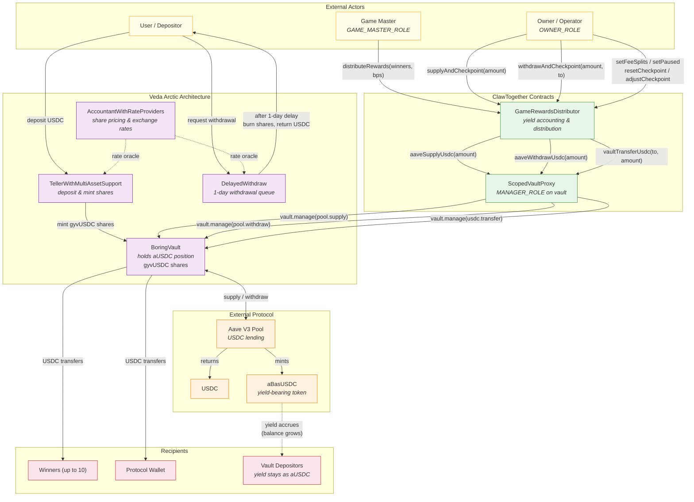
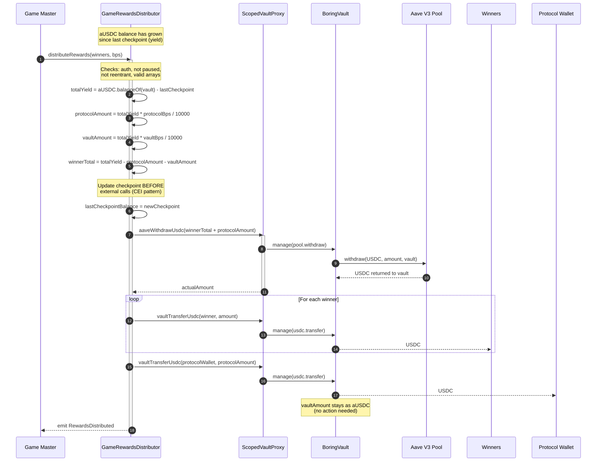
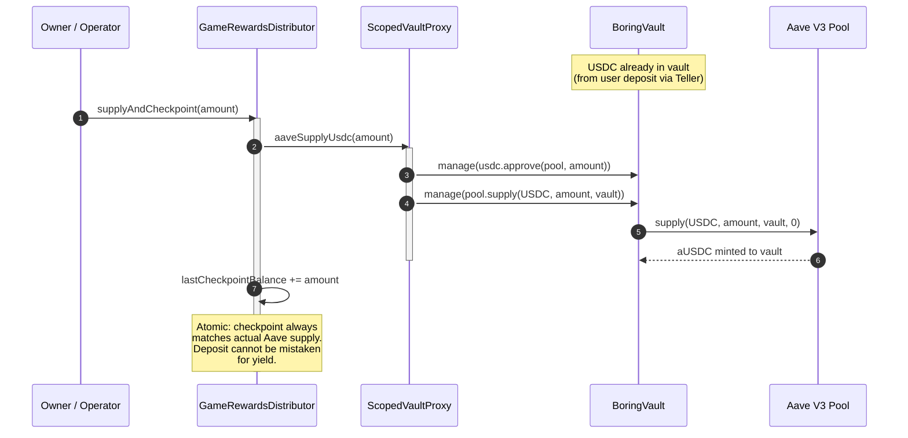
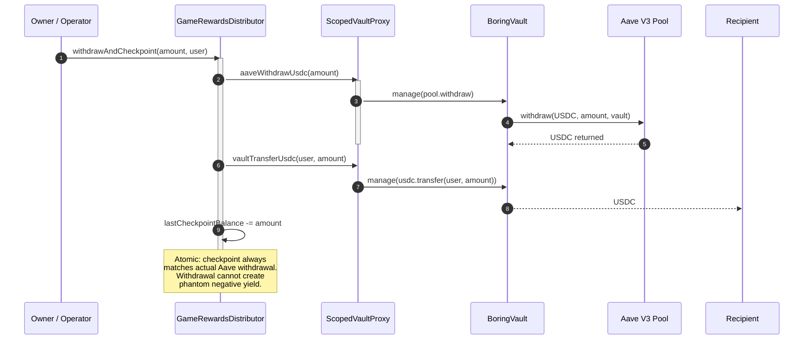
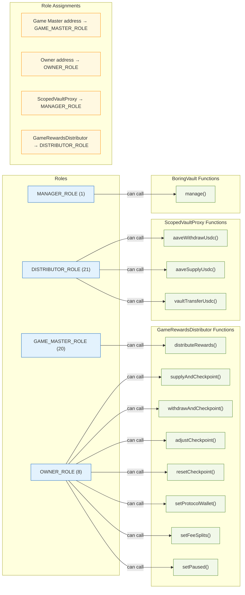
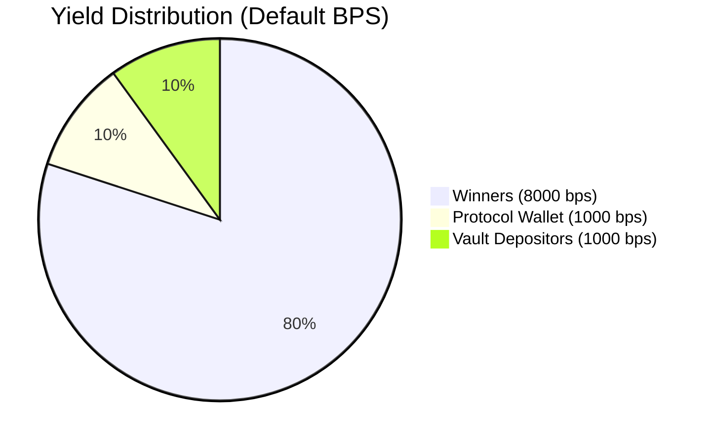

# ClawTogether Contract Architecture

## System Overview

## Reward Distribution Flow

## Atomic Deposit Flow (supplyAndCheckpoint)

## Atomic Withdrawal Flow (withdrawAndCheckpoint)

## Access Control (RolesAuthority)

## Fee Split (Default: 80 / 10 / 10)

